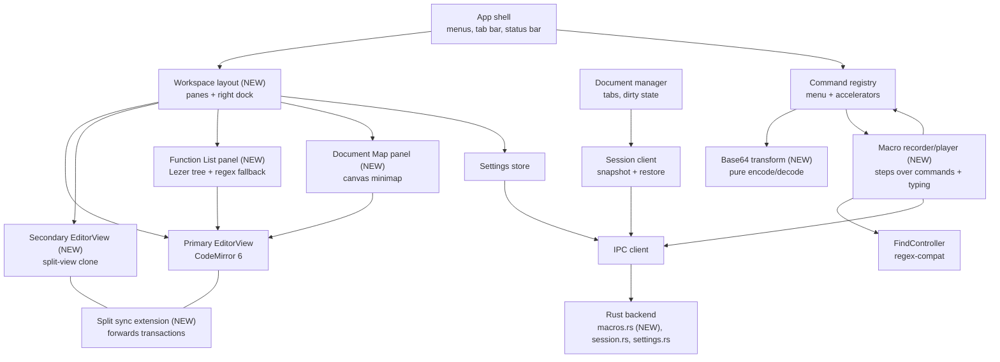
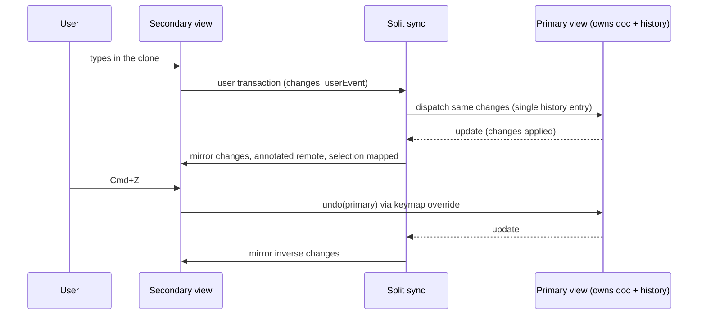
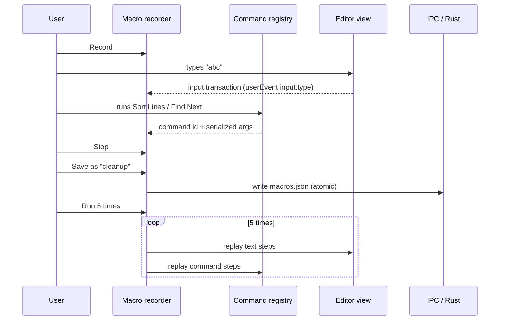

## Context

next-notepad (`notepad-next/`, Tauri 2 + CodeMirror 6) has the editing core, tabs, session restore, Find/Replace, JSON tools, formatters, language support and the Edit menu operations. It lacks macros, split view, Function List, Document Map, view-state restore and Base64 transforms (see `proposal.md`).

Current frontend shape that constrains this design:

- `App` (`src/app/app.ts`) owns one `EditorView` and a `Map<tabId, EditorState>`; switching tabs calls `view.setState`, which preserves per-tab undo history.
- `DocumentManager` (`src/docs/documentManager.ts`) holds tab metadata and `text` as a string. Menu actions are `Command` entries (`id`, `label`, `accelerator`, `run`) in `src/app/commands.ts`.
- Session snapshots (`src/session/snapshot.ts`, Rust `session.rs`) are debounced about 2 s and written atomically by the backend. Settings use the same pattern (`settings/model.ts`, `settings.rs`).
- In force: ADR 0001 (Tauri 2 + CodeMirror 6), ADR 0002 (the Rust backend owns the filesystem and session store), ADR 0003 (`regex-compat` with a JS fallback), ADR 0004 (macOS Playwright WebKit e2e; it amends ADR 0001's confirmation section). None is superseded. The main spec `session-restore` currently says cursor, scroll and undo history are not required to be restored, which D6 changes for cursor and scroll.

Diagrams are plain Mermaid in the hybrid C4 style used by the archived `macos-flutter-notepad` design. The `c4-diagrams` skill named in this repo's design rules is not installed in this environment, so that precedent was followed instead. Only the levels that answer a real question are drawn: a component diagram (what is new inside the frontend) and two dynamic diagrams (split-view sync and macro replay). The container level is unchanged apart from one new Rust command module.

### Component diagram: new and changed frontend parts

### Dynamic diagram: split-view edit sync

### Dynamic diagram: macro record and playback

## Goals / Non-Goals

**Goals:**
- Add macro recording and playback, split view, Function List, Document Map, cursor/scroll restore and Base64 transforms to next-notepad on macOS and Windows.
- Reuse existing seams: the command registry, `FindController`, the debounced session snapshot, the settings store and the Rust atomic-write helper.
- Keep every new behavior unit-testable without a UI, and add macOS Playwright e2e coverage for the new UI.
- Add no heavy dependencies. Lezer already ships with CodeMirror 6.

**Non-Goals:**
- Plugin system, shell integration and registry settings, compare/diff, auto-completion, Run menu, print/export.
- Undo-history restore across sessions and OS-level multi-instance handling.
- Notepad++ `shortcuts.xml` macro compatibility.
- Tree-sitter or other WASM parsers for the Function List.
- Floating or freely dockable panels.

## Decisions

### D1. Split view: one primary view owns the document, the clone mirrors it

The secondary `EditorView` is created with the same extensions as the primary. A `splitSync` extension forwards user transactions from whichever pane was edited to the primary, and mirrors the resulting changes back to the other pane with a `remote` annotation so they are not forwarded again. The primary's single `history()` is the only undo stack, and the clone's undo/redo keys call undo/redo on the primary. Selection and scroll stay per pane; the mirrored selection is mapped through the changes.

Alternatives: two independent copies (diverge, contradicts the clone requirement); a shared `EditorState` across two views (CodeMirror views each hold their own state, so it needs the same forwarding anyway); a new document model outside CodeMirror (large rewrite). Closing the split destroys only the secondary view, so the primary state in the per-tab `Map` is untouched. Per-pane tabs are not added: a split always shows the active tab in the primary pane and a clone of it in the secondary, and "Move to other pane" swaps which pane has focus. Split layout is not restored from the session.

### D2. Macros are recorded as high-level steps, not raw key events

A macro is an ordered list of steps: `{ type: "text", insert | delete }` for typing and deletion, and `{ type: "command", id, args? }` for registry commands, including Find/Replace commands (which carry the search options, so they replay through `FindController` and `regex-compat`). Typing is captured from CodeMirror transactions with `userEvent` of `input.*` or `delete.*`, expressed relative to the selection so it replays at any position. Commands are captured by wrapping `Command.run` in the registry, which already gives every menu action a stable id.

Persisted format is versioned JSON (`{ version: 1, macros: [{ name, shortcut?, steps }] }`) in the app-data directory, written by a new `macros.rs` using the same atomic-write helper as session and settings (ADR 0002: the Rust backend owns persistence). Playback runs N times or until the end of the file (stopping when a command reports no match or the caret cannot advance), and a whole playback is one undo group. Recording and playback are mutually exclusive, and commands that open dialogs or tabs are not recordable and are rejected with a toast.

Alternatives: record raw key events (breaks across layouts and menus), store Notepad++ XML (unwanted coupling and a heavy parser). Raw events are also unusable on macOS, where many commands come from native menus.

### D3. Function List reads the Lezer syntax tree, with a regex fallback

Each supported language maps to a small table of Lezer node names to symbol kinds (for example `FunctionDeclaration`, `ClassDeclaration`, `MethodDeclaration`, `ATXHeading`). The list is rebuilt on a debounced document change from `syntaxTree(state)`, forcing the parse with a time budget through `ensureSyntaxTree`. For languages whose grammar exposes too little (SQL, YAML, plain text with headings), a per-language regex table runs line by line instead. Results are `{ name, kind, line }`; the panel has a filter box and click-to-jump, and it rebuilds when the tab or language changes.

Alternatives: regex only (fragile with nested or multi-line constructs); tree-sitter via WASM (new dependency, second parser beside the highlighter). Unparsed regions caused by a timeout show the last good list rather than an empty one.

### D4. Document Map is a canvas minimap fed by a downsampled line scan

The map draws each line as a row of 1–2 px colored runs onto a `<canvas>`, using the line's leading whitespace and length plus a coarse token color from the highlighter. A rectangle shows the visible viewport; click and drag set `scrollDOM.scrollTop`. Redraw is debounced to animation frames and only runs while the panel is visible. Above about 50k lines (or the existing large-file threshold) the map is disabled and the panel shows a notice instead of drawing, so a large file never slows editing.

Alternatives: DOM blocks (too many nodes for large files); a second hidden `EditorView` at a small scale (full layout cost and extra memory).

### D5. Right dock: Function List and Document Map share one layout container

`Workspace layout` wraps the editor area (one or two panes) and a right-hand dock holding the two panels. View menu toggles show or hide each panel; visibility is stored as two booleans in `Settings` (`showFunctionList`, `showDocumentMap`) and mirrored in the Rust `Settings` struct with `serde(default)` so existing settings files load unchanged. The panels are not draggable or floating.

### D6. Cursor and scroll restore extend the session snapshot with optional fields

This is a delta against the `session-restore` main spec, whose "text content only" requirement is modified.

`TabSnapshot` gains optional `selection` (anchor, head) and `scrollTop`, in both the TypeScript interface and the Rust `TabSnapshot` as `Option` with `serde(default)`. They are captured at snapshot time from the stored `EditorState` or the live view, and applied on restore after the document is loaded, clamped to the text length so a file that changed on disk never produces an out-of-range selection. Old `session.json` files lack the fields and restore as before. The existing debounce is reused; scroll changes mark the session dirty but do not shorten the 2 s debounce. Undo history is still not restored.

### D7. Base64 is a pure module, applied per selection, all-or-nothing

`src/edit/base64.ts` exposes `encode(text, urlSafe)` and `decode(text, urlSafe)`: UTF-8 through `TextEncoder`/`TextDecoder`, chunked `btoa`/`atob`, whitespace stripped before decoding and missing `=` padding tolerated. Four commands (`base64.encode`, `base64.decode`, `base64.encodeUrl`, `base64.decodeUrl`) sit under Edit → Base64. They act on each selection range, or on the whole document when every range is empty. If any range fails (invalid alphabet or invalid UTF-8), nothing is changed and a toast gives the reason, matching the "invalid input is never modified" rule of Format Document. The edit is one transaction, so it is one undo step.

## Risks / Trade-offs

- [Split-sync feedback loops or lost updates] -> The `remote` annotation guards against re-forwarding, and unit tests drive both directions plus undo from either pane.
- [Macro steps depend on command ids staying stable] -> Ids are the registry's existing stable strings, the file is versioned, and an unknown id at playback stops the macro with a toast naming the step.
- [Typed-text steps replay differently with different selections] -> Steps are relative to the current selection, and the playback contract is documented in the macro spec.
- [Function List parse cost on large files] -> Debounce, parse time budget, and disabling the panel's refresh above the large-file threshold.
- [Document Map cost on large files] -> The size cutoff in D4 and drawing only while visible.
- [`session.json` growth or schema drift] -> Optional fields with defaults and a round-trip test with an old-format fixture.
- [Three system webviews render canvas and scroll slightly differently] -> macOS Playwright e2e covers behavior; Windows is covered by unit tests and CI until Windows e2e exists (ADR 0004 keeps e2e macOS-only for now).

## Migration Plan

No data migration. New settings keys and session fields are optional with defaults, so old `settings.json` and `session.json` load unchanged, and a rollback to the previous build ignores the new keys. `macros.json` is created on first save. Roll out behind no flag: the panels default to hidden and the split to closed, so existing behavior is unchanged until a user opts in.

## Open Questions

- None of the in-force ADRs (0001–0004) needs revisiting. The adr step should still record durable decisions from D1 (split-view sync model) and D2 (macro step format and persistence).
- Whether typed-text macro steps should also capture IME composition input is left for a later change; v1 records committed text only.
