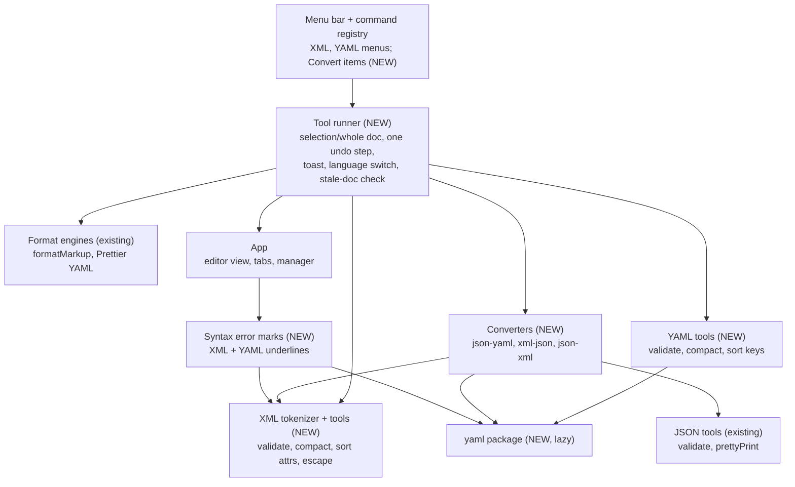
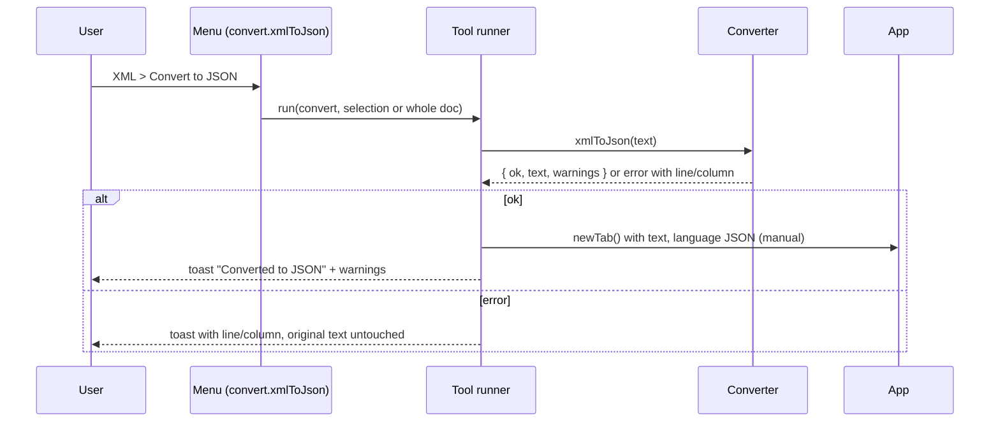

## Context

next-notepad already has JSON tools (`src/json/jsonTools.ts` returning `{ ok, text } | { ok: false, message, offset, line, column }`, `jsonCommands.ts` running them on the selection or whole document as one undo step, `editor/jsonErrors.ts` for live underlines) and a shared Format Document (`src/format/format.ts`: a built-in markup formatter for XML, Prettier for YAML). This change adds the same kind of toolset for XML and YAML, and conversions between JSON, YAML and XML (see `proposal.md`).

In force: ADR-0001 (Tauri 2 + CodeMirror 6), ADR-0002 (Rust owns files and session), ADR-0003 (regex-compat), ADR-0004 (macOS Playwright e2e), ADR-0005 (split view), ADR-0006 (macros as high-level steps). None is superseded, and none constrains this change: it is frontend-only and adds ordinary registry commands, which macros already record (ADR-0006), except conversions, which open a tab and so are not recordable (see D8).

Diagrams are plain Mermaid in the hybrid C4 style used by earlier designs. The `c4-diagrams` skill named in this repo's design rules is not installed here, so that precedent was followed. Only the levels that answer a real question are drawn: a component diagram and one dynamic diagram. The container level does not change (no Rust work).

### Component diagram: new frontend parts

### Dynamic diagram: a conversion

## Goals / Non-Goals

**Goals:**
- XML: format, compact, validate, sort attributes, escape/unescape, live error underline.
- YAML: format, compact to flow style, validate, sort keys, live error underline.
- Convert JSON to YAML, YAML to JSON, XML to JSON, JSON to XML into a new tab.
- Reuse the existing Format engines and the JSON tools' selection, result and undo conventions, so the three formats behave alike.
- Pure, synchronous-where-possible transform modules that are unit-testable without a UI, and identical in every webview.

**Non-Goals:**
- XML to YAML and YAML to XML (chain through JSON), sorting XML elements, escape/unescape for YAML.
- Changing JSON tools or Format Document behavior; refactoring `jsonCommands.ts` onto the new runner (possible later).
- Schema validation (XSD, JSON Schema, Kubernetes schemas) and XML namespace resolution.
- Opening files from the command line (`kubectl edit`), which is the separate change `open-files-from-cli`.

## Decisions

### D1. One result shape, per-format pure modules, one shared runner

Each transform is a pure function returning `{ ok: true, text, warnings? } | { ok: false, message, line, column, offset? }`, the same shape as the JSON tools. A single `runTool` in `src/tools/` does everything that is not format-specific: pick the selection or whole document, abort if the document changed while an async transform ran (as `runFormatDocument` does), apply the result as one transaction (one undo step), place the caret on an error when the whole document was processed, show the toast, and switch a plain-text tab to the right language. Alternatives: copy `jsonCommands.ts` per format (three divergent copies), or refactor JSON onto the runner now (avoidable regression risk for no user value).

### D2. XML is checked with our own strict tokenizer, not `DOMParser`

`src/xml/tokens.ts` splits XML into positioned tokens (open, close, self-closing, text, comment, CDATA, processing instruction, doctype) and a stack check reports the first error with line and column: mismatched or unclosed tags, attributes without quotes, duplicate attributes, a bare `&`, unknown entities, text before the root, and several roots (allowed when processing a selection as a fragment). Compact, sort and escape work on this token stream and copy untouched tokens verbatim, so nothing the user wrote changes except what the command is meant to change. `DOMParser` was rejected: its error text and positions differ between WebKit, WebView2 and jsdom, it cannot be unit-tested the same everywhere, and it gives no token positions to rewrite from. The existing `format/markup.ts` tokenizer is HTML-lenient and stays as it is for Format.

### D3. XML operations

- **Compact:** drop whitespace-only text between tags, comments and processing instructions, including indentation and line breaks; never alter non-blank text; leave elements under `xml:space="preserve"` alone.
- **Sort attributes:** rewrite each open or self-closing tag with its attributes ordered by name (ordinal, case-sensitive), each attribute's raw text and quoting kept, joined by single spaces. Element order is never changed.
- **Escape / Unescape:** escape `& < > " '`; unescape those five named entities and numeric references (`&#65;`, `&#x41;`), leaving unknown entities as written. Escape applied to already-escaped text double-escapes by design, and Unescape reverses exactly one level.
- **Format:** `formatMarkup(text, { html: false })` with the chosen unit (2 spaces, 4 spaces, tab). After D2's validation, so a document that is not well-formed is reported with a position instead of being guessed at.

### D4. YAML uses the `yaml` package for everything except Format

The `yaml` package (loaded with `import()` on first use) provides `parseAllDocuments` with error positions, a `Document` model that keeps comments, `sortMapEntries`, and `collectionStyle: "flow"`.

- **Validate:** every document is parsed; the first error's line and column are reported.
- **Sort keys:** parse, sort mapping entries at every depth with `sortMapEntries: true` (ascending, comments stay with their keys, list order untouched, anchors and aliases preserved), stringify.
- **Compact:** refused with an explanation for multi-document input. Otherwise comments are cleared from the Document, then it is stringified in flow style with line wrapping off, and a toast says comments were dropped. Anchors and aliases survive flow style in this package, so unlike the proposal's first wording only multi-document input is refused; anchors need no refusal.
- **Format:** Prettier's `yaml` parser through the existing `formatCode`, with `tabWidth` 2 or 4 and tabs never offered, so XML > Format, YAML > Format and Format Document agree.

### D5. Selection handling

The runner follows the JSON rule (selection if any, else the whole document). XML accepts a selection with several roots as a fragment (the tokenizer's single-root rule is switched off). YAML dedents the selection by its common leading whitespace, processes it as its own document, and re-indents every non-blank line to the original level; if it cannot be parsed alone the text is left untouched with the error toast.

### D6. Conversions are pure converters that return a new tab's content

- **JSON to YAML:** validated with the JSON tools first (so errors carry JSON positions), parsed with the `yaml` package so number text and key order are kept, then stringified in block style with a 2-space indent.
- **YAML to JSON:** `parseAllDocuments`, one document becomes its value and several become an array; anchors and aliases are expanded with the package's alias-count limit (protects against alias bombs); comments are dropped and counted; non-string keys become strings with a warning when that changes their meaning; values JSON cannot hold (`.nan`, `.inf`) are an error naming the key path. Output is `JSON.stringify` with 2 spaces.
- **XML to JSON** (`@attr` / `#text` convention): the root element name is the top-level key; attributes are `@name` keys; repeated sibling elements become an array; a text-only element becomes a string; an empty element becomes `""`; CDATA and entities become plain text; namespace prefixes stay in names (`ns:tag`, `@xmlns:ns`); text mixed with child elements is concatenated into `#text` and reported as lossy; comments and processing instructions are dropped and counted, because JSON has no place for them (and YAML to JSON does the same).
- **JSON to XML:** the reverse rules. A top-level object with exactly one key and a non-array value is the root; anything else is wrapped in `<root>`. `@name` becomes an attribute, `#text` becomes text, arrays become repeated elements, scalars become text (`null` becomes an empty element), and the result is serialized with 2-space indentation and escaped text. A key that is not a valid XML name is an error naming its path. The pair is round-trip safe for data without mixed content, comments or processing instructions.

### D7. Live error underlines come from one generalized extension

`editor/syntaxErrors.ts` factors the debounce-then-dispatch-an-effect structure of `jsonErrors.ts` into `languageErrorMarks({ validate, className })`, used by the XML and YAML language loaders in `lang/languages.ts` exactly where JSON's marks are attached today, so marks exist only on tabs of that language. XML validates synchronously with D2. YAML validates asynchronously (the `yaml` import is awaited, then the view is checked still alive). Both skip empty text and documents over the same 1,000,000-character limit as JSON. `jsonErrors.ts` is left unchanged.

### D8. Menus, ids, undo and macros

New top-level **XML** and **YAML** menus sit next to JSON, with ids `xml.format2`, `xml.format4`, `xml.formatTabs`, `xml.compact`, `xml.sortAttributes`, `xml.escape`, `xml.unescape`, `xml.validate`, `yaml.format2`, `yaml.format4`, `yaml.compact`, `yaml.validate`, `yaml.sortKeys`. Conversions are listed in each source format's menu (`convert.jsonToYaml` and `convert.jsonToXml` in JSON, `convert.yamlToJson` in YAML, `convert.xmlToJson` in XML). No accelerators are assigned, to avoid collisions. In-place commands are one undo step and are recorded by macros as ordinary registry commands. `convert.*` opens a tab, so `macro/recordable.ts` adds the `convert.` prefix to its refused list (the macro spec already says tab-opening commands are not recorded).

### D9. The converted text opens in a new untitled tab

The runner creates a tab, inserts the text and sets its language with the manual flag (so content detection never overrides it). The original document and selection are untouched. Nothing is lost if the user picks the wrong command, which an in-place conversion could not guarantee.

## Risks / Trade-offs

- [YAML default schema is 1.2 while Kubernetes tooling parses YAML 1.1, where `yes`/`no`/`on`/`off` are booleans] -> Use the `yaml` package's 1.2 core schema (it matches Prettier and most editors), state this in the YAML to JSON notice when such a bare scalar is present, and leave a YAML 1.1 option as an open question.
- [Stringifying a YAML Document may restyle details (indentation of sequences under keys, quote choice)] -> It is used only for Sort and Compact, which are explicit rewrites; Format uses Prettier; tests assert comments, key order and anchors survive.
- [XML Compact removes whitespace that matters in mixed content] -> Only whitespace-only text between tags is removed, `xml:space="preserve"` is honored, and the spec documents it.
- [XML to JSON is lossy for mixed content, comments and processing instructions] -> Reported in a toast every time it happens; JSON to XML round-trip is only promised for data without them.
- [Large integers lose precision when read as JavaScript numbers] -> JSON to YAML keeps number text through the YAML parser; YAML to JSON warns when an integer exceeds 2^53.
- [A new dependency] -> `yaml` is small, has no dependencies, is imported lazily, and is already the parser Prettier's YAML plugin wraps conceptually; it adds nothing to start-up.
- [A hand-written XML tokenizer can miss an XML 1.0 rule] -> Scope is well-formedness only (no DTD processing or entity definitions), covered by a table-driven test of valid and invalid documents, and Format stays on the existing, already-tested engine.

## Migration Plan

No data or settings changes and no Rust changes. New menus appear on upgrade, and nothing existing changes behavior. Rolling back removes the menus and the `yaml` dependency.

## Open Questions

- None of the in-force ADRs needs revisiting. The adr step should record D6's XML to JSON mapping convention as a durable decision, since later changes (such as XML to YAML or a JSON tree view) will depend on it.
- Should a YAML 1.1 mode exist for Kubernetes-style files (`yes`/`on` as booleans)? Left for later unless the notice in D4 proves insufficient.
- Comments and processing instructions are dropped on XML to JSON (the earlier discussion said "kept as written"; JSON cannot represent them, so this design drops them with a notice). Confirm this reading.
