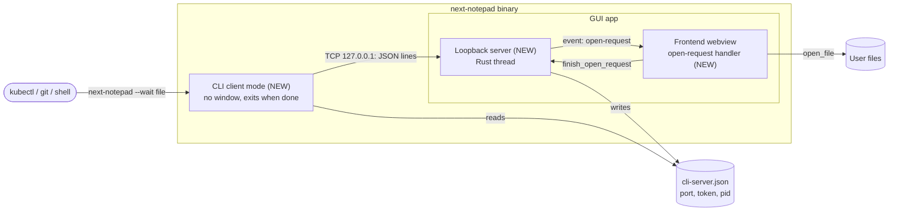
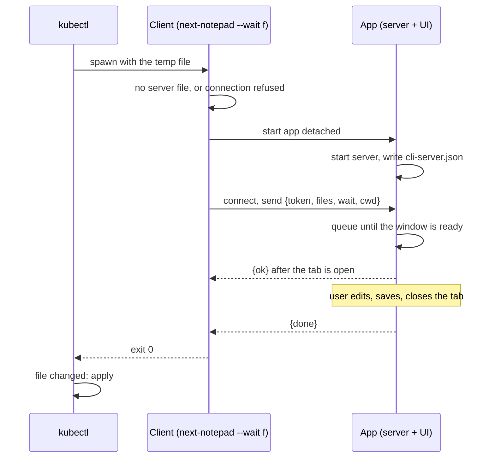

## Context

next-notepad is a Tauri 2 app (ADR-0001). `run()` in `src-tauri/src/lib.rs` builds the window directly and ignores `std::env::args`; the frontend opens files through `App.openPath(path)`, which already focuses a tab for a file that is open. The Rust backend owns all file access (ADR-0002). `main.rs` uses the GUI subsystem on Windows release builds, so there is no console.

Tools such as `kubectl edit` run `$KUBE_EDITOR <tempfile>` as a child process, wait for it to exit, then apply the file if it changed. The editor therefore needs a process that exits exactly when the user is done with the file (see `proposal.md`).

In force: ADR-0001 to ADR-0008. This change adds a local IPC mechanism; none of them is superseded. The `c4-diagrams` skill named in the repo rules is not installed, so Mermaid in the C4 style of earlier designs is used.

### Container diagram

### Dynamic diagram: `kubectl edit` with the app closed

## Goals / Non-Goals

**Goals:**
- `next-notepad --wait file` works as `KUBE_EDITOR` and `GIT_EDITOR` on macOS and Windows, with the same behavior whether or not the app was running.
- Never lose a request that arrives while the app is starting, and never hang the calling tool when the app dies.
- Keep protocol, server and client unit-testable without a window or a display.

**Non-Goals:**
- `file:line` syntax, default-app registration, `PATH` editing by the Windows installer, a window per request.
- Remote use: the server is for this machine and this user only.

## Decisions

### D1. The same binary is the client; no arguments means GUI

At the top of `run()`, arguments are parsed (`cli.rs`). With no arguments (ignoring macOS's legacy `-psn_` argument) the GUI starts as before. With arguments the process runs as a client and exits with a code, before any Tauri or window code runs, so there is no Dock icon, no focus steal and fast start. `--help` and `--version` print and exit 0, an unknown flag prints usage to stderr and exits 2. Alternatives: a separate CLI binary (two artifacts to build, sign and install) or a shell script that calls `open -W` (cannot wait for one file, no Windows story).

### D2. Our own loopback server instead of the single-instance plugin

Tauri's single-instance plugin forwards arguments but its second process exits at once, so it cannot implement waiting. A small server on `127.0.0.1` with an ephemeral port works the same on macOS, Windows and Linux without named-pipe or Unix-socket code. It is not reachable from other machines. The app writes `cli-server.json` (`{port, token, pid}`) in the app-data directory (owner-only permissions on Unix) and removes it on a clean exit. The token is 128 random bits from the OS; a request with a wrong token is answered with an error and closed. A stale file after a crash is harmless: the client treats a refused connection as "app not running", and the next app start overwrites it.

### D3. Protocol: one JSON object per line

Client to app: `{"token", "files": [absolute paths], "wait": bool, "cwd"}`. App to client: `{"ok": true}` once the files are open, then `{"done": true}` in wait mode, or `{"error": "message"}` at any point. Lines are limited to 1 MiB and the first line must arrive within 5 seconds. The client resolves relative paths against its own working directory, because the app's directory is unrelated.

### D4. The app starts on demand

If the server file is missing or the connection is refused, the client spawns its own executable with no arguments, detached (a new process group on Unix, `DETACHED_PROCESS` on Windows, no inherited stdio), then polls every 100 ms for up to 10 seconds. If the app cannot be started or reached the client prints why to stderr and exits 3, so the calling tool treats the edit as failed.

### D5. Opening and waiting are driven by the frontend through the server

The server assigns each request an id and hands it to a sink. In the app the sink emits an `open-request` event `{id, paths, wait}` once the frontend has called `cli_ready` (earlier requests are queued in Rust). The frontend opens every path, calls `open_request_opened(id, error?)` so the server answers `{ok}` or `{error}`, and, in wait mode, calls `finish_open_request(id)` when every tab it opened or focused has been closed, which makes the server answer `{done}`. On app quit it finishes every pending wait first, so a normal quit exits 0 while a crash (the connection closing without `done`) exits 1. The window is shown, un-minimized and focused for every request.

### D6. Paths: missing files open empty, open files are focused

The frontend reuses `App.openPath`. A path that does not exist opens an empty tab bound to that path (created by the first save). A file that is already open is activated and its existing tab is the one waited on. If a file cannot be opened (for example a declined large-file warning, or a directory) the request is answered with `{error}`.

### D7. macOS "opened" events share the path

On macOS the run loop's opened-files event feeds the same sink with `wait = false`, so `open -a next-notepad f` and Dock drops behave like the command without `--wait`.

### D8. Windows console

The release build has no console, so before printing the client calls `AttachConsole(ATTACH_PARENT_PROCESS)` through `windows-sys` (feature `Win32_System_Console`); if attaching fails, output is lost but the exit code still reports the result.

### D9. Installing the command

A Help dialog shows the path of the running executable and the `KUBE_EDITOR` text. On macOS an Install button creates a symlink `next-notepad` to the executable in `/usr/local/bin` when it is writable, otherwise in `~/.local/bin` (created if needed), replacing a symlink it made earlier and refusing to overwrite anything else. It reports the path and, if the directory is not on `PATH`, how to add it. The text builder is a pure function: shell (`export KUBE_EDITOR="... --wait"`), PowerShell (`$env:KUBE_EDITOR = ...`) and `setx` forms, with quoting for paths that contain spaces.

## Risks / Trade-offs

- [A local process could connect to the server] -> Loopback only and a 128-bit token in an owner-only file; a process that can read the file already runs as the user.
- [The app is slow to start and the calling tool times out] -> The client polls for 10 seconds and prints a clear message with exit 3; the request is queued until the window is ready.
- [`kubectl edit` applies a half-saved file] -> Done is only sent when the tab closes; a crash exits 1, which `kubectl` treats as failure.
- [Unsaved edits are lost when the tab is closed] -> A normal close asks to save (or keeps the text per the Close-without-prompting setting); an unsaved close leaves the file unchanged, so `kubectl` sees no change and cancels, as intended.
- [The Windows console attach and spawn flags cannot be tested on macOS] -> The code is small and `cfg`-gated, CI builds Windows, and the manual checklist covers a real run.
- [Ports and the token file need cleanup on crash] -> Stale files are tolerated by design (D2).

## Migration Plan

No data or settings changes. The command exists only if the user installs the symlink or uses the full executable path. Rolling back removes the server and client code; `cli-server.json` is ignored.

## Open Questions

- None of the in-force ADRs needs revisiting. The adr step should record the loopback-IPC decision (D2, D3), since later features (opening files from other tools, a CLI `diff`) will reuse it.
- Whether the Windows installer should add the install directory to `PATH` is left for a later change.
